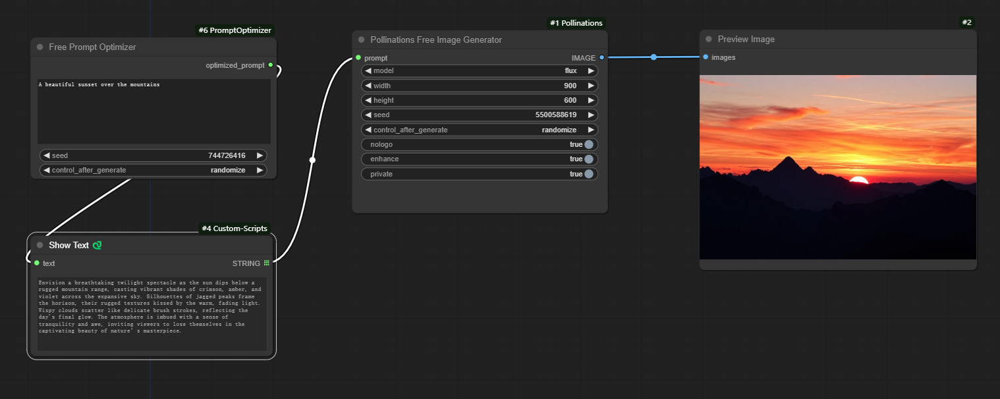

# ComfyUI-PromptOptimizer

**ComfyUI-PromptOptimizer** is a custom node for ComfyUI designed to optimize prompts for text-to-image models. It leverages Pollinations' free models to transform user-input prompts into more detailed, diverse, and vivid descriptions, making them better suited for generating high-quality images. No local model required.

[](https://www.gnu.org/licenses/gpl-3.0)


## Features

- **Prompt Optimization**: Optimizes user-input prompts to generate versions better suited for text-to-image models.
- **Multilingual Support**: Automatically translates non-English prompts into English.
- **Rich Details**: Adds details such as setting, colors, lighting, and overall mood.
- **Style Expansion**: Expands on visual styles or artist references if included in the prompt.
- **Diverse Output**: Avoids repetitive vocabulary and phrases to ensure unique and varied prompts.
- **Easy Integration**: Seamlessly integrates into your ComfyUI workflow as a custom node.


## Installation

1. Clone this repository into the `custom_nodes` directory of your ComfyUI installation:

   ```bash
   git clone https://github.com/your-username/ComfyUI-PromptOptimizer.git
   ```

2. Launch ComfyUI and ensure the `Free Prompt Optimizer` node is available in the node list.


## Usage

1. Add the **Free Prompt Optimizer** node to your ComfyUI workflow.
2. Input your original prompt in the `prompt` field.
3. Run the workflow. The node will output an optimized prompt tailored for text-to-image models.

### Example



**Input Prompt:**
```
A beautiful sunset over the mountains.
```

**Optimized Prompt:**
```
Envision a breathtaking twilight spectacle as the sun dips below a rugged mountain range, casting vibrant shades of crimson, amber, and violet across the expansive sky. Silhouettes of jagged peaks frame the horizon, their rugged textures kissed by the warm, fading light. Wispy clouds scatter like delicate brush strokes, reflecting the day's final glow. The atmosphere is imbued with a sense of tranquility and awe, inviting viewers to lose themselves in the captivating beauty of nature’s masterpiece.
```


## License

This project is licensed under the **GNU General Public License v3.0 (GPL-3.0)**. See the [LICENSE](LICENSE) file for details.

## Contributing

Contributions are welcome! If you'd like to contribute, please follow these steps:

1. Fork the repository.
2. Create a new branch for your feature or bugfix.
3. Submit a pull request with a detailed description of your changes.


## Support

If you encounter any issues or have questions, please open an issue on the [GitHub repository](https://github.com/your-username/ComfyUI-PromptOptimizer/issues).

## Acknowledgments

- Thanks to the [ComfyUI](https://github.com/comfyanonymous/ComfyUI) team for creating an amazing framework.
- Thanks to [Pollinations](https://pollinations.ai/) for providing the free APIs that make this project possible.


Enjoy optimizing your prompts and creating stunning images with **ComfyUI-PromptOptimizer**! 🚀

